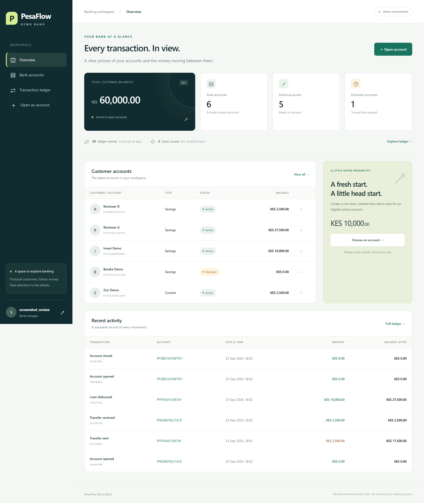
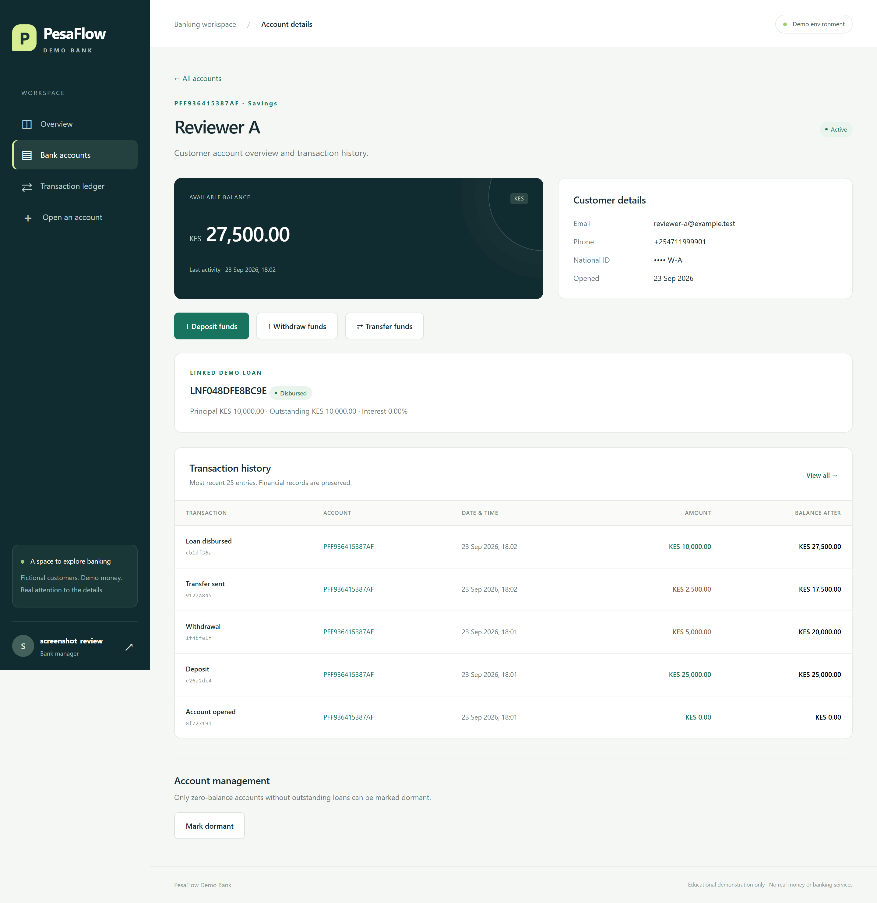
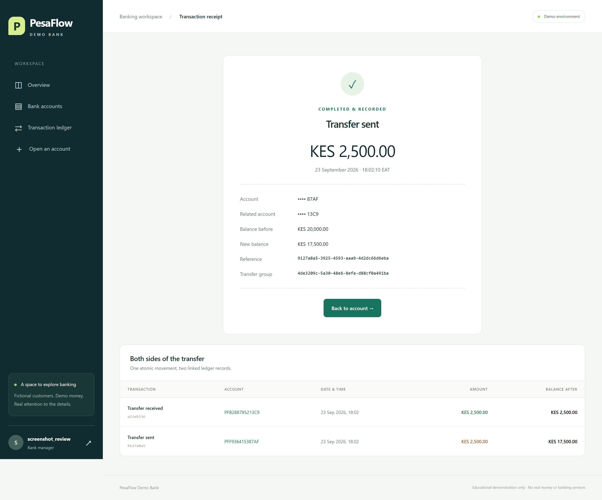
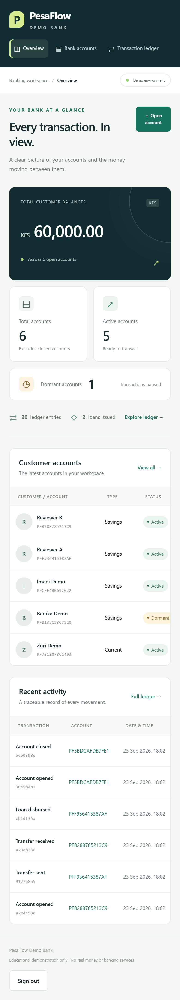
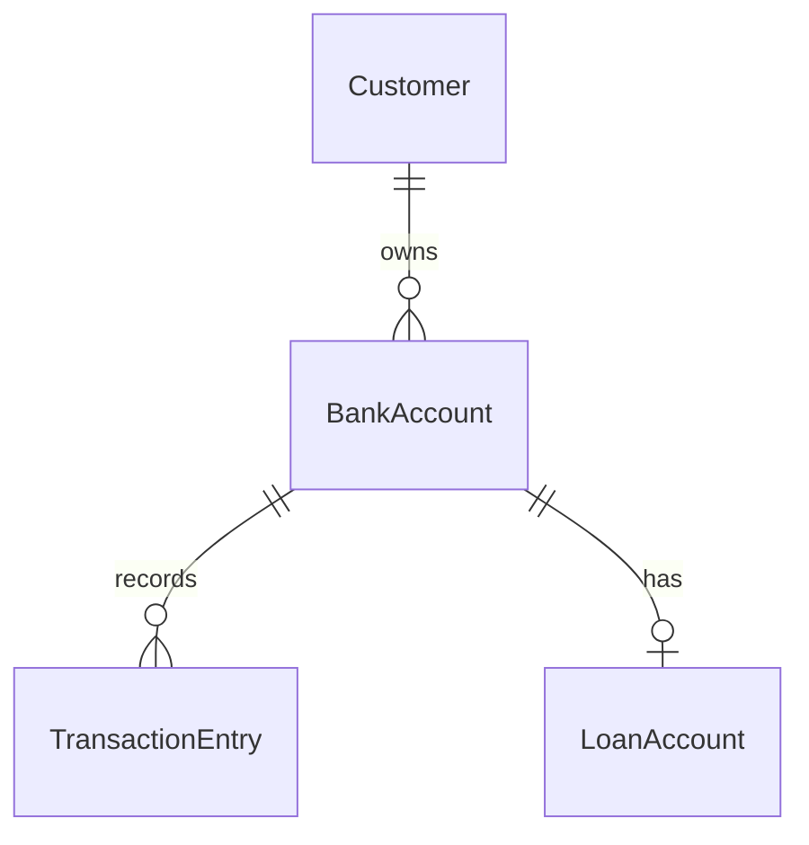

# PesaFlow · KES Banking Transaction Interface

[](https://github.com/Tonnybraxton/banking-transaction-interface/actions/workflows/ci.yml)

A staff-operated Django banking assessment: open accounts, deposit, withdraw,
transfer, safely close dormant accounts, and disburse a one-time **KES 10,000.00**
loan. Every money movement has an atomic balance update and an audit receipt.

**Educational demo only. No real money, banking services or real customer data.**

Python 3.12+ · Django 5.2 · SQLite · Django templates · Bootstrap 5.3.8 ·
vanilla JavaScript · pytest · Ruff

## 60-second reviewer quick start

With Python 3.12+ and Git installed (dependency download time varies):

```powershell
git clone https://github.com/Tonnybraxton/banking-transaction-interface.git
cd banking-transaction-interface
python -m venv .venv
.\.venv\Scripts\Activate.ps1
python -m pip install -r requirements.txt
python manage.py migrate
python manage.py seed_demo
python manage.py changepassword demo_manager
python manage.py runserver
```

Open <http://127.0.0.1:8000> and sign in as `demo_manager` with the password you
just chose. The seed creates five fictional customers, example movements, active,
dormant and closed accounts, and an account eligible for the loan demonstration.
It is safe to run again: existing balances, passwords and sample records are
preserved. No default password is distributed.

If PowerShell activation is restricted, use `.\.venv\Scripts\python.exe` in
place of `python` in subsequent commands; changing execution policy is unnecessary.

## Screenshots

Real, full-page captures of the running local application with fictional demo
records, saved as lossless PNGs at 2× pixel density. Click any image to view it
at its original resolution.

**Staff dashboard**



**Account and linked loan**



**Transfer receipt and paired ledger records**



<details>
<summary>Mobile dashboard</summary>



</details>

## Requirement verification

All six workflows run through the normal authenticated UI.
The complete evaluator path is tested in
[`test_evaluator_journey`](banking/tests/test_views.py).

| Assignment requirement | UI location | Focused automated test |
| --- | --- | --- |
| Create bank account | Open an account | `test_account_creation` |
| Deposit funds | Account → Deposit funds | `test_deposit` |
| Withdraw funds | Account → Withdraw funds | `test_withdraw`, `test_insufficient_funds_rollback` |
| Transfer funds | Account → Transfer funds → paired receipt | `test_transfer`, `test_failed_transfer_rollback` |
| Delete dormant account | Account → Mark dormant → Close dormant account | `test_dormant_closure`, `test_invalid_closure` |
| Create and disburse KES 10,000 loan | Account → Create & Disburse KES 10,000 Loan | `test_loan_disbursement_once`, `test_loan_failure_rolls_back` |

The focused financial tests are in [`test_services.py`](banking/tests/test_services.py).
Additional tests cover permissions, CSRF, invalid identifiers, duplicate identities,
immutable ledger records, database constraints, forms, filters, seed idempotency,
and competing withdrawals.

## Evaluator journey

1. Sign in as `demo_manager`. Open a new savings account for fictional Customer A.
2. Deposit **KES 25,000.00** from its detail page.
3. Withdraw **KES 5,000.00**; the receipt shows **KES 20,000.00** remaining.
4. Create Customer B and a second account.
5. Transfer **KES 2,500.00** from A to B. Inspect both linked ledger entries:
   A has **KES 17,500.00**, B has **KES 2,500.00**.
6. On A, confirm **Create & Disburse KES 10,000 Loan**. The account now holds
   **KES 27,500.00**, with a linked disbursed loan of **KES 10,000.00**.
7. Create another zero-balance account. Mark it dormant, then confirm closure.
   Select **Closed** in the account list to find its retained records.
8. Explore the ledger using account, transaction type and date filters.

Use fictional names and IDs, unique `@example.test` emails, and distinct Kenyan
mobile-format numbers. An existing customer can also be selected to open another
account without duplicating customer identity data.

## Local installation

### Windows PowerShell

Use the quick-start commands above. Optional persistent local configuration:

```powershell
Copy-Item .env.example .env
python -c "import secrets; print(secrets.token_urlsafe(50))"
```

Paste the generated value into `SECRET_KEY` in `.env`. Keep this file local.
Without a key, DEBUG mode generates an ephemeral development key; sessions may
expire after a server restart. Set a persistent key for predictable local sessions.

### macOS / Linux

```bash
git clone https://github.com/Tonnybraxton/banking-transaction-interface.git
cd banking-transaction-interface
python3 -m venv .venv
source .venv/bin/activate
python -m pip install -r requirements.txt
cp .env.example .env
python -c "import secrets; print(secrets.token_urlsafe(50))"
# Paste the generated value into SECRET_KEY in .env.
python manage.py migrate
python manage.py seed_demo
python manage.py changepassword demo_manager
python manage.py runserver
```

The project was exercised locally on Windows with Python 3.14.3 and Django
5.2.17. CI runs the checks on Linux with Python 3.12 and 3.14. The Unix activation
commands are platform equivalents, not a claim of a local macOS test.

### Staff permissions

`seed_demo` creates groups and staff users with unusable passwords:

| Group | Access |
| --- | --- |
| Teller | View accounts and ledger, create accounts, deposit, withdraw, transfer |
| Manager | All Teller access plus dormancy, closure and loan disbursement |

```bash
python manage.py changepassword demo_teller
python manage.py createsuperuser
```

Choose your own passwords at the prompts. A superuser can use `/admin/` to create
additional users, enable their **Staff status**, and assign the **Teller** or
**Manager** group. Both staff status and the corresponding custom banking
permission are enforced server-side. Financial records in admin are read-only.

## Architecture and data model



- **Customer:** normalized unique email, Kenyan mobile and national ID; public UUID.
- **BankAccount:** generated random account number, public UUID, KES decimal
  balance, account type, activity time and lifecycle status.
- **TransactionEntry:** unique reference, movement type, amount, before/after
  balances, timestamp and shared transfer reference.
- **LoanAccount:** one-to-one account link, fixed principal, outstanding amount,
  status and disbursement time.

Views handle HTTP, permissions and messages. Forms validate submitted data.
Selectors build read queries. All account and money mutations live in
[`banking/services.py`](banking/services.py), inside `transaction.atomic()`.
Services re-fetch account balances with `select_for_update()`; transfers lock both
accounts in primary-key order and record both sides in the same transaction.
Any validation or write failure rolls back the entire operation.

The ledger blocks ordinary ORM edits/deletes and admin mutations. Database
constraints enforce nonnegative balances, KES currency, valid account states,
fixed loan principal and consistent ledger balance snapshots. Opening/closure
entries intentionally have zero amounts; financial movements are positive.

## Financial rules

- Active accounts only for deposits, withdrawals, transfers and loans.
- Positive exact decimal amounts, at most two decimal places, up to
  **KES 10,000,000.00** per movement; no overdrafts or transfers to the same account.
- Maximum account balance: **KES 999,999,999,999.99**.
- Account and loan numbers are generated on the server. Clients never set balances.
- Exactly one **KES 10,000.00**, 0%-interest demo loan per account. Both service
  validation and a database one-to-one constraint prevent duplicate loans.
- Manual dormancy requires zero balance and no outstanding loan. Closure requires
  dormant status plus the same balance/loan checks and explicit confirmation.
- Closure is a **soft delete**: customer, account, loan and ledger records remain.
  Closed accounts are excluded from default account lists and dashboard totals,
  but remain accessible using the Closed filter.

## Verification

Run from an activated virtual environment:

```bash
python manage.py check
python manage.py makemigrations --check --dry-run
python -m pytest
python -m ruff check .
python -m ruff format --check .
```

The verified local suite has **91 passing tests** and **100% statement coverage**
of the banking app (tests and migrations excluded). The enforced coverage floor
is 85%. Coverage is a measurement of executed code, not a guarantee of correctness.
All five quality checks above passed locally. Migrations and `seed_demo` were also
run successfully, and the six main workflows were exercised in the browser.

Desktop and mobile screenshots are real captures. Browser checks covered the
dashboard and account layout at desktop, 390px mobile and 768px tablet widths.
The mobile dashboard and account detail fit their viewport without page-level
horizontal overflow; wide data tables scroll within their own containers.

## Security, concurrency and limits

- Banking routes require staff authentication and permissions; mutations use POST
  and CSRF protection. Manager controls are also restricted in templates.
- `.env`, SQLite databases, virtual environments, caches and local test artifacts
  are excluded from Git. Use only fictional personal data.
- SQLite does not implement row-level `select_for_update()` locks. IMMEDIATE
  transactions serialize writers before reading balances; a busy operation is
  rejected without a partial movement. The UI asks the operator to retry.
- PostgreSQL can replace the database configuration and use the existing row
  locks. It needs its driver, deployment configuration and separate concurrency
  testing; it is not part of the default setup.
- There is no loan repayment, interest accrual, account reactivation, external
  payment integration or full double-entry general ledger.
- Normal payments do not have durable request idempotency keys. Inspect the ledger
  before retrying after an uncertain network response. One-time loans are protected
  against repeat disbursement.
- Direct SQL/database administrators can bypass ORM immutability. Production
  financial controls require independent review and stronger audit infrastructure.
- The development server and DEBUG defaults are for localhost. Production would
  require HTTPS, a real application server, persistent secrets, secure deployment
  settings, monitoring, backups, access controls and a broader security review.

See [assessment notes](ASSESSMENT_NOTES.md) for assumptions and manual acceptance
steps. Future improvements include durable request idempotency, actor audit logs,
PostgreSQL load testing, repayment workflows and reconciliation.

## Repository and license

[GitHub repository](https://github.com/Tonnybraxton/banking-transaction-interface)
· [MIT license](LICENSE)

Bootstrap is distributed under its authors' MIT license; see
[`static/vendor/BOOTSTRAP-LICENSE`](static/vendor/BOOTSTRAP-LICENSE).
